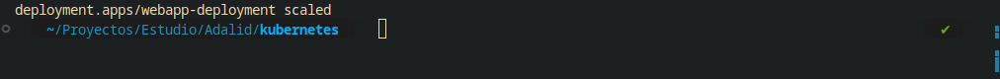

# Kubernetes

## Equipo 2

- Francisco Leiva
- Guillermo Torres

## Preguntas Finales

### ¿Cuál es la diferencia entre un Pod y un Deployment?

#### Pod

Un **Pod** es la unidad más pequeña y básica de despliegue en Kubernetes. Representa un grupo de uno o más contenedores que:

- Comparten almacenamiento y red
- Se ejecutan en el mismo nodo
- Tienen un ciclo de vida conjunto
- Son efímeros por naturaleza

**Características:**

- Creación manual y gestión directa
- No tiene capacidades de autoreparación
- Si falla, debe ser recreado manualmente
- Adecuado para tareas puntuales o pruebas

#### Deployment

Un **Deployment** es un objeto de alto nivel que gestiona un conjunto de Pods idénticos. Proporciona:

- Escalabilidad automática
- Actualizaciones declarativas
- Rollback automático en caso de fallos
- Autoreparación (recreación automática de Pods fallidos)

**Características:**

- Gestión automática del ciclo de vida
- Estrategias de actualización controladas
- Garantiza el número deseado de réplicas
- Ideal para aplicaciones en producción

---

### ¿Por qué es útil usar un ConfigMap o un Secret?

#### ConfigMap

Los **ConfigMaps** permiten separar la configuración del código de la aplicación:

**Ventajas:**

- **Desacoplamiento**: La configuración se mantiene independiente del código
- **Reutilización**: Un mismo ConfigMap puede ser usado por múltiples aplicaciones
- **Flexibilidad**: Cambios de configuración sin necesidad de reconstruir imágenes
- **Gestión centralizada**: Configuraciones organizadas y versionadas

**Casos de uso:**

- Variables de entorno
- Archivos de configuración
- Parámetros de aplicación

#### Secret

Los **Secrets** manejan información sensible de forma segura:

**Ventajas:**

- **Seguridad**: Datos codificados y almacenados de forma segura
- **Control de acceso**: Permisos granulares sobre quién puede acceder
- **Rotación**: Facilita la rotación de credenciales
- **Auditoría**: Seguimiento de acceso a información sensible

**Casos de uso:**

- Contraseñas de bases de datos
- Tokens de API
- Certificados TLS
- Claves de cifrado

---

### ¿Qué ventajas ofrece Kubernetes frente a ejecutar contenedores manualmente con Docker?

#### Orquestación y Gestión

- **Autoescalado**: Ajuste automático de recursos según demanda
- **Autoreparación**: Recreación automática de contenedores fallidos
- **Distribución de carga**: Balanceeo automático entre nodos
- **Gestión de recursos**: Asignación eficiente de CPU y memoria

#### Operaciones Avanzadas

- **Actualizaciones sin downtime**: Rolling updates y blue-green deployments
- **Rollback automático**: Reversión rápida ante fallos
- **Health checks**: Monitoreo continuo de la salud de las aplicaciones
- **Service discovery**: Comunicación automática entre servicios

#### Escalabilidad y Alta Disponibilidad

- **Cluster multi-nodo**: Distribución de workloads entre múltiples servidores
- **Tolerancia a fallos**: Resistencia ante caídas de nodos individuales
- **Gestión de estado**: Manejo de aplicaciones con y sin estado
- **Networking avanzado**: Políticas de red y seguridad

#### Ecosistema y Extensibilidad

- **Integración con herramientas**: CI/CD, monitoreo, logging
- **Operadores**: Automatización de tareas operativas complejas
- **Helm charts**: Gestión de paquetes y plantillas
- **Multi-cloud**: Portabilidad entre diferentes proveedores de nube

---

### ¿Qué desafíos crees que enfrentaría esta app en producción?

#### Seguridad

- **Gestión de secretos a escala**: Rotación y distribución segura de credenciales
- **Políticas de red**: Implementación de microsegmentación
- **Imágenes vulnerables**: Escaneo y actualización continua de contenedores
- **Control de acceso**: RBAC (Role-Based Access Control) granular

#### Monitoreo y Observabilidad

- **Logging centralizado**: Agregación de logs de múltiples pods y nodos
- **Métricas y alertas**: Monitoreo de rendimiento y disponibilidad
- **Trazabilidad**: Seguimiento de requests entre microservicios
- **Debugging distribuido**: Diagnóstico de problemas en sistemas complejos

#### Gestión de Recursos

- **Resource limits**: Configuración adecuada de CPU y memoria
- **Storage persistente**: Gestión de volúmenes para datos persistentes
- **Network policies**: Control de tráfico entre pods
- **Quality of Service**: Priorización de workloads críticos

---

### Evidencia

#### Estado inicial

#### Escalado

#### Estado Final

#### Exposición

#### Configuración

### Diagrama de arquitectura

### Reflexión final

Kubernetes definitivamente cambia las reglas del juego cuando se trata de manejar aplicaciones en contenedores.
Aunque tiene su curva de aprendizaje elevada e intimidante al principio, vale la pena por sus prestaciones.

La capacidad de escalar automáticamente, recuperarse de fallos y gestionar configuraciones de forma centralizada hace que valga la pena el esfuerzo inicial. En resumen, aunque Kubernetes puede parecer complejo, te ahorra muchos dolores de cabeza a largo plazo y te permite concentrarte en lo que realmente importa: desarrollar buenas aplicaciones en lugar de preocuparte constantemente por la infraestructura.
